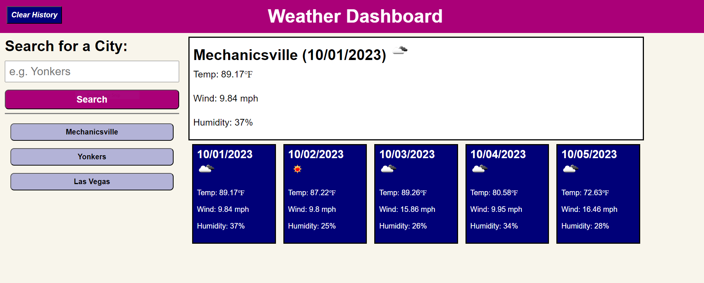

# Week 6 Challenge - Weather Forecast

## Description
This week's challenge was to design a web application that would allow the user to enter a city name, which would then bring up the expected weather for the current day as well as for the next five days. In addition, the web application would be able to save previous searches, allowing the user to quickly look at the weather for any location they'd looked up previously even after leaving the page.

I was a bit worried at first when looking over the expected product, but once I was underway I was surprised how straightforward it was. Even with a few roadbumps, a bulk of the code was composed in an organic way. It was motivating to see the work I've been putting in the past few weeks lead to some very visible results.

Working with API's was a little tricky, but once I figured out how to fetch them in the first place, it was much easier to read through the response to see exactly how to pull out the info I needed to display. There was an issue that I couldn't rectify, being that the standard OpenWeather API call does not go up to 5 days, so i can only technically display the weather for the next four days. It seems the only way to actually get the fifth day is through their explicit 5-day forecast/3 hours, so I could probably call that query and then store that data locally to reduce the amount of times I would need to call that API, but there didn't seem to be an easy workaround for that situation.

I also added a button to allow the user to clear the current history and the locally stored entries in case they wanted a fresh page.

## Screenshot

## Link to Deployed Application
https://chasinggatsby.github.io/w6c-weather-fc/